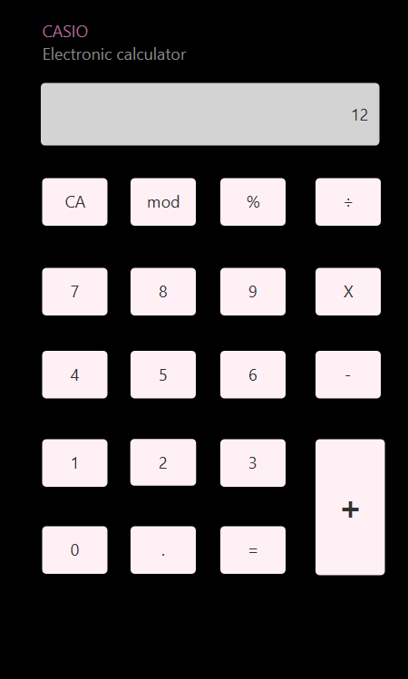
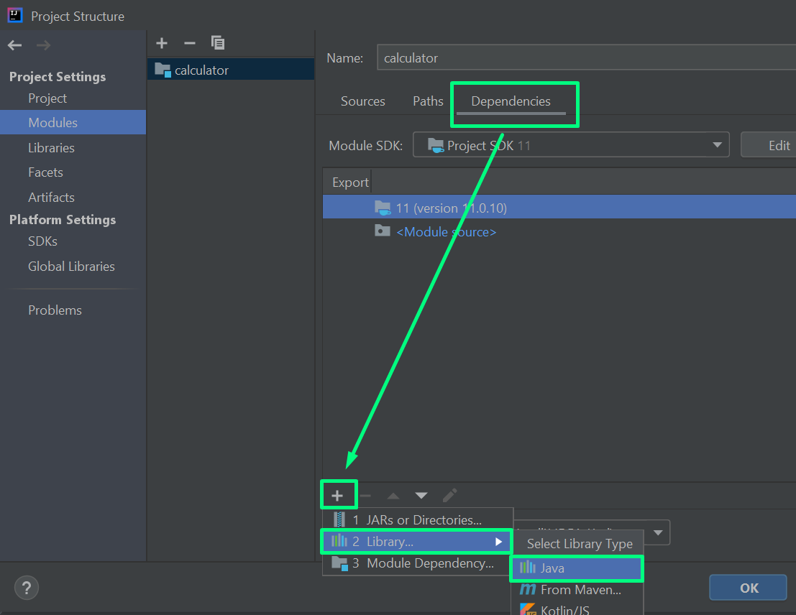
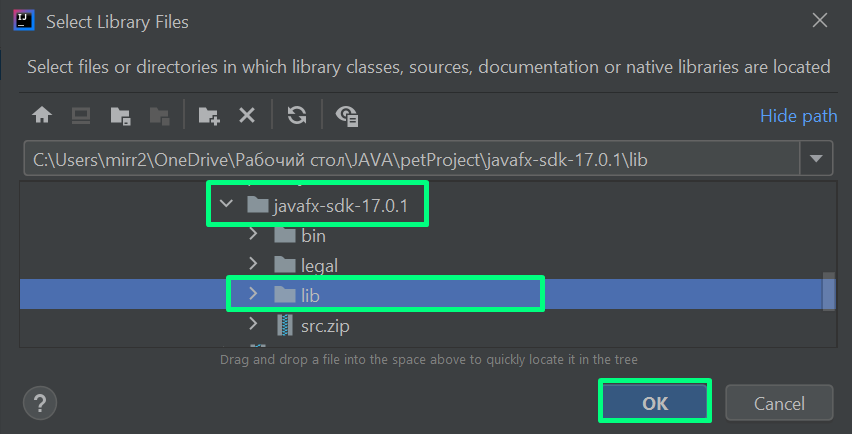
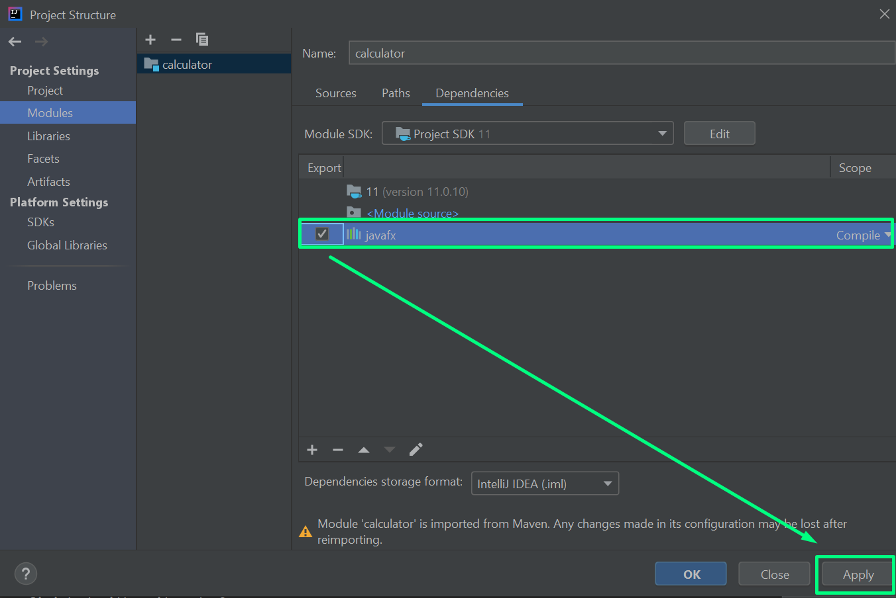

# Calculator

## How to use:

To try the calculator, the following steps can be followed:

1) Clone this repository using the command: git clone `https://github.com/yunsenaMir/Calculator.git`
2) Open the project in IntellijIdea as a Maven project
3) Download the JavaFX SDK 11.0.2 from [here](https://gluonhq.com/products/javafx/), depending on your platform. Unzip and situate the folder to any place. 
4) Open Project Structure -> Modules and add the folder "lib" from inside the javafx folder (from the previous step) as a new dependency.

   

   
   
   
   
5) Open Run-> File Configuration -> Add VM and insert the following:

   --module-path `full path to your JavaFX SDK\lib` --add-modules javafx.controls,javafx.fxml

 
